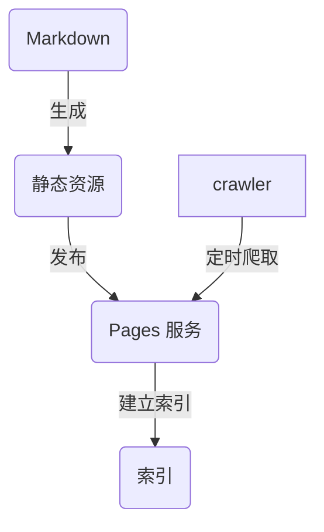

> [!NOTE]
> 本章内容由 AI 生成

# Markdown 索引器

## 背景

Algolia 的 DocSearch 服务为文档站提供了便捷的搜索功能，但其工作流程是这样的：

这套流程原本是可行的，但随着对搜索质量要求的提升，问题逐渐显现：网站本身就是用 markdown 构建的，却要通过爬虫去解析生成的 HTML，多了一层不必要的转换。

这种间接方式带来的问题不只是效率低，更重要的是准确性难以保证。HTML 结构会随着主题更新而变化，爬虫需要不断调整解析规则。而 markdown 源文件的结构是稳定的，直接解析源文件反而更可靠。

另一个考量是时效性。我的博客通过 GitHub Actions 自动部署，部署时会通知搜索引擎索引新页面。既然索引更新已经是自动化流程的一部分，为什么 Algolia 的索引不能也自动化呢？

于是就有了这个 Markdown 索引器。

## 设计思路

索引器的核心思路很简单：既然有 markdown 源文件，为什么不直接读取源文件来建立索引，而是绕一圈去解析 HTML？

这样有几个好处：

### 更及时

代码推送后几分钟内就能完成索引更新，不需要等爬虫定时抓取。爬虫通常是按计划执行，可能几个小时才抓取一次，而索引器是在部署流程中直接执行，代码一推送就会触发。

### 更准确

直接读取源文件，避免了 HTML 解析可能出现的各种问题。主题更新、组件变化都不会影响索引生成，因为解析的是稳定的 markdown 格式。

### 更可控

索引生成完全在自己的控制下，可以按需求调整索引结构。想添加新的字段、修改排序规则、调整搜索权重，都可以直接修改代码，不需要依赖第三方服务。

## 架构概览

索引器采用了模块化设计，主要包含以下几个部分：

### 核心引擎

核心引擎负责整个索引流程：

1. **扫描文档目录**，找到所有 markdown 文件
2. **解析每个文件**，提取 frontmatter 和正文内容
3. **调用处理器生成索引数据**
4. **按索引名称分组**
5. **批量上传到 Algolia**

这个流程完全在本地执行，不需要等待外部服务的回调或轮询。所有数据处理都在自己的控制下，出错时也能快速定位和修复。

### 处理器模式

处理器是插件式的，每个处理器负责生成特定类型的索引。这种设计让扩展变得简单，想添加新的索引类型只需要写一个新的处理器。

目前实现了两个处理器，它们分工不同：

#### Markdown 处理器

将整篇文章作为一个索引，记录标题、完整内容、标签、分类等信息。生成的是**整页索引**，专门用于 Algolia 的 AskAI 搜索。

AskAI 需要完整的上下文信息，所以整篇文章作为索引更合适。更重要的是，AskAI 只能理解纯文本内容，对于结构化的 JSON 数据（如层级字段）是无法解析的。整页索引保留了原始的 markdown 格式，AskAI 可以直接理解文本内容和文章结构。如果只索引章节，AskAI 无法把握文章的全貌，难以提供准确的引用和总结。

#### Content 处理器

将 markdown 按标题层级拆分，每个章节都是独立的索引。生成的是**章节索引**，用于普通用户搜索。

普通用户搜索更关注精准定位，按章节拆分后可以直接跳转到具体内容，而不是整篇文章。搜索结果会显示树状层级结构，用户能快速理解内容在文档中的位置。

两个索引服务于不同的场景，各有优势。整页索引适合 AI 深度理解，章节索引适合用户快速定位。

### 层级结构

Content 处理器会为每个索引记录完整的层级路径，比如：

- `lvl0`：顶级分类（文章、书签等）
- `lvl1`：一级标题
- `lvl2`：二级标题
- ...

搜索结果会显示树状层级结构，用户能快速理解内容在文档中的位置。

这个层级结构不是简单的面包屑导航，而是反映了文档的实际组织方式。用户可以看到这个内容属于哪篇文章、哪个章节，甚至能直接点击父级标题跳转。

## 为什么需要两组索引

普通搜索和 Algolia AskAI 的需求是不同的。

普通搜索用户希望快速找到具体内容，点击后直接跳转到相关位置。如果搜索"配置"，用户不想看整篇文章，只想看配置章节的内容。章节索引正好满足这个需求。

AskAI 则不同，它需要完整的 markdown 文本来理解内容。AskAI 只能处理纯文本，无法理解结构化的层级字段。如果只给 AskAI 章节内容，它无法理解章节之间的关系，也无法提供准确的引用和总结。整页索引保留了原始的 markdown 格式，AskAI 可以直接理解文本内容和文章结构，从而提供更准确的回答。

两个索引互为补充，各自服务于不同的使用场景。

## 效果

- **发布新文章后几分钟内就能搜索到**：不需要等爬虫定时抓取
- **搜索能定位到具体章节**：而不是整页，更精准
- **搜索结果显示完整的层级路径**：用户能快速理解内容位置
- **索引更新完全自动化**：不需要人工干预，和网站部署同步
- **数据准确性高**：直接解析 markdown，不受主题变化影响

比爬虫方案更及时、更可控，搜索体验也更好。
